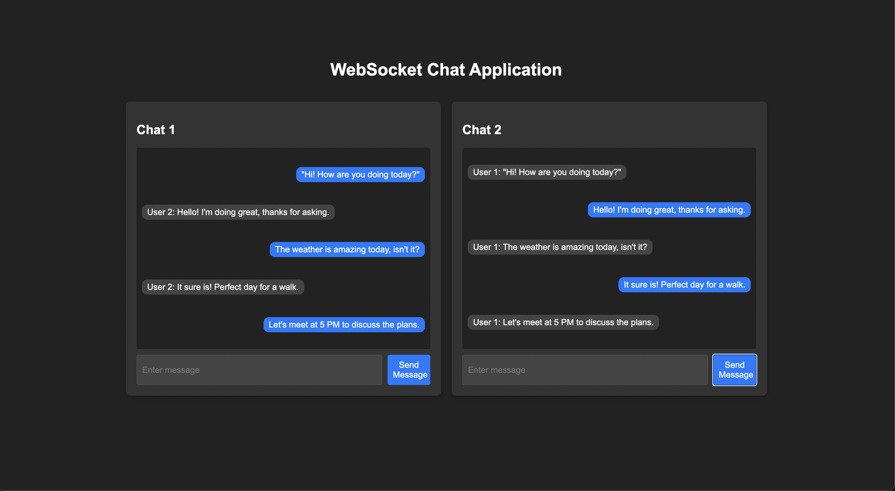

# WebSocket Chat Application

A simple real-time chat application using WebSockets, HTML, CSS, and JavaScript.

## Features
- Real-time two-way communication.
- Responsive and user-friendly UI.
- Dynamic alignment of sent and received messages.

## Setup
1. Clone the repository:
   ```bash
   git clone https://github.com/PaulSebastianKrus/chatApp.git
   cd chatApp
  
## Screenshot of the Chat Application

